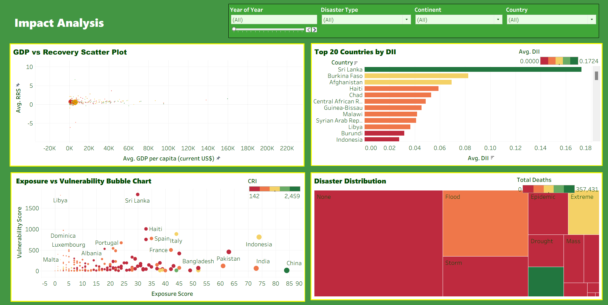
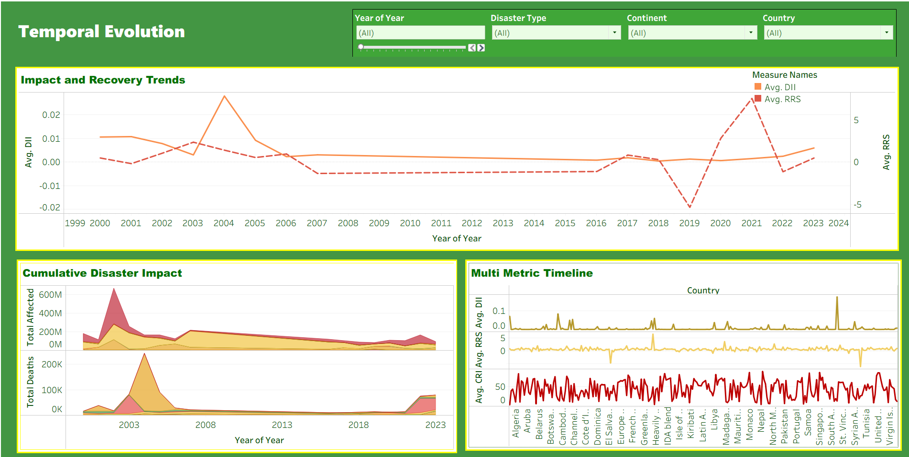
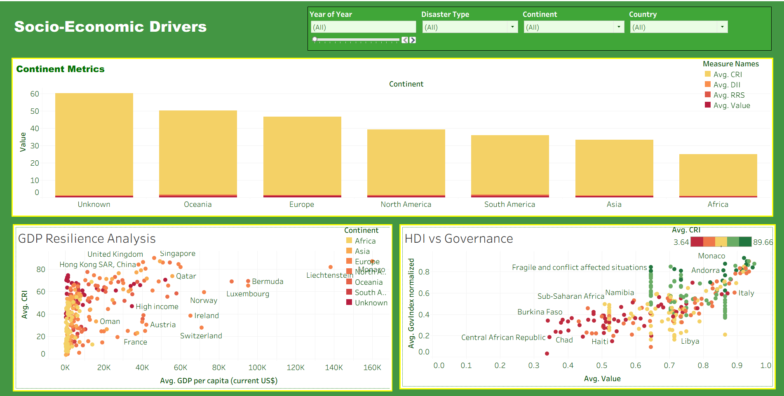

# 🌍 Global Disaster Resilience Analytics

**An Interactive Tableau Dashboard Project**

This project analyzes disaster resilience across **195 countries** over **24 years (2000-2024)**. By integrating data from EM-DAT, the World Bank, and the UNDP, these dashboards help visualize how different nations cope with and recover from natural disasters based on socio-economic factors.

---

## 📸 Dashboard Previews

### 1. Global Overview
*A comprehensive map view of disaster resilience (CRI) scores across the globe.*

### 2. Impact Analysis
*Analyzing the correlation between GDP, recovery time, and disaster impact.*

### 3. Temporal Evolution
*Tracking disaster trends and recovery metrics over the last two decades.*

### 4. Socio-Economic Drivers
*Understanding how Governance and HDI scores affect a country's resilience.*

---

## 📊 Key Features
* **Resilience Scoring:** Custom metrics like the *Composite Resilience Index (CRI)* to rank countries.
* **Trend Analysis:** Visualizes the rise in climate-related disasters vs. recovery speeds.
* **Drill-Down Capability:** Filter data by Year, Continent, Disaster Type, and Country.
* **Correlation Studies:** Compares Governance quality against disaster recovery times.

## 🛠️ Tools & Technologies
* **Visualization:** Tableau Desktop 2024
* **Data Processing:** Python (Pandas) & Excel
* **Data Sources:** EM-DAT, World Bank Open Data, UNDP

## 📂 How to Run
1.  Clone this repository.
2.  Open the `.twbx` file in **Tableau Desktop**.
3.  Navigate through the "Story" tabs to view the complete analysis.

---

## 👥 Team
* **Muhammad Abubakar** - Dashboard Development & Feature Engineering
* **Muhammad Usman** - Data Engineering & Documentation
